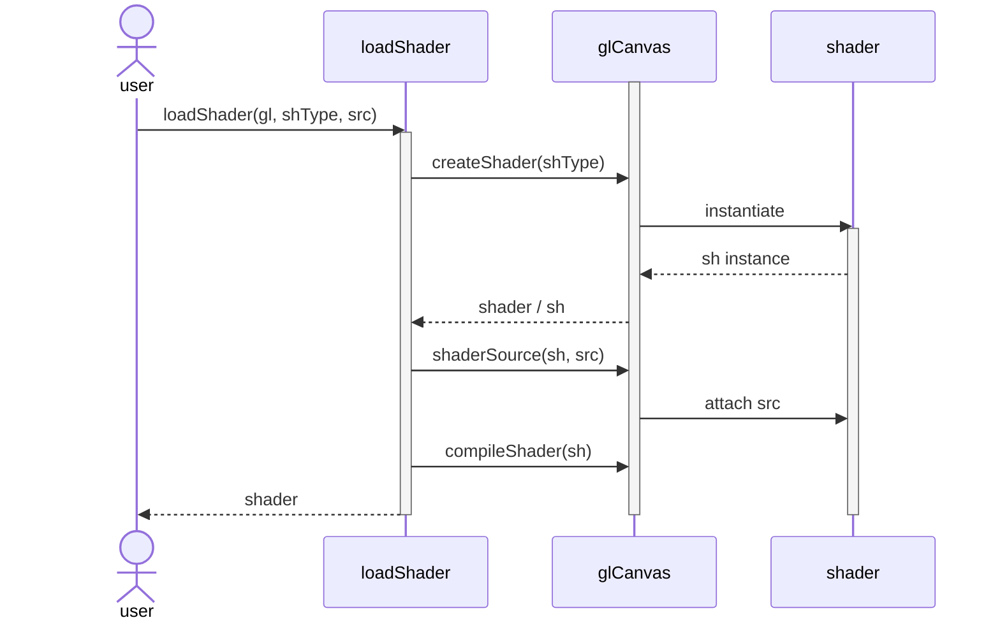
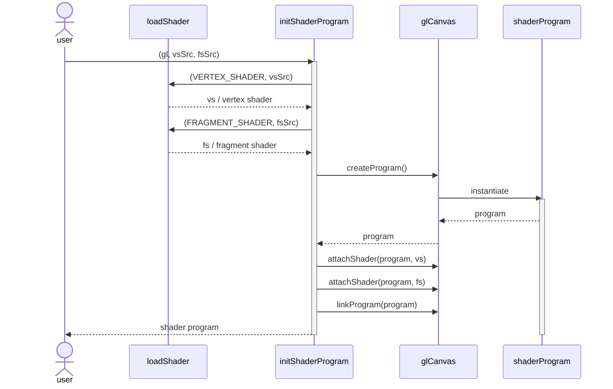
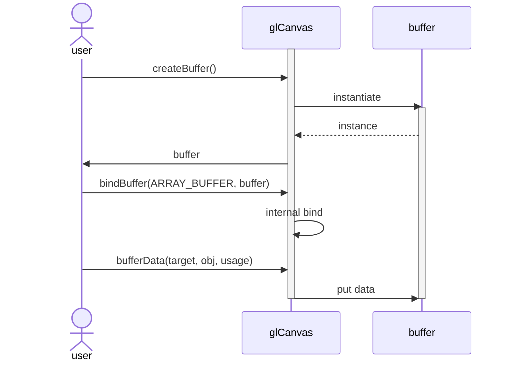
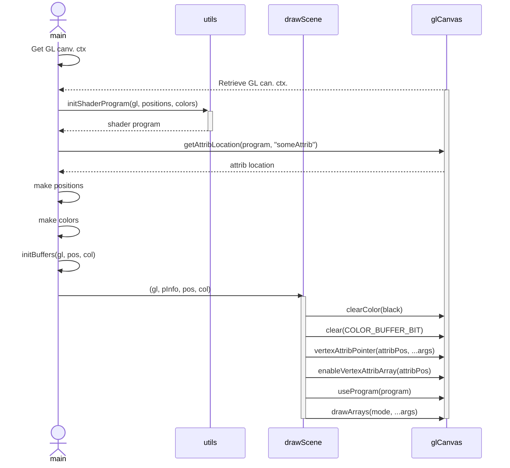

# WebGL

## Basic program overview

### Taxonomy

- **shType** : shader type
- **src** : shader source
- **sh** : shader
- **gl** : WebGL canvas
- **vs** : Vertex Shader
- **fs** : Fragment Shader

### Load shader sequence diagram

Described:

- instantiate a shader object for a WebGL canvas
- attach a shader source code to the shader object
- compile the shader
- return the cooked shader

### Shader program initialization sequence diagram

Described:

- load vertex shader
- load fragment shader
- create a shader program instance
- attach vertex shader to program
- attach fragment shader to program
- link the program
- retrieve the program

### Buffer initialization sequence diagram

Described:

- create a buffer
- bind the buffer to the canvas
- initialize the buffer data with an array
- retrieve the buffer

Taxonomy:

- target : can be ARRAY_BUFFER or ELEMENT_ARRAY_BUFFER
- obj : the actual array with vertices or colors
- usage : STATIC_DRAW, DYNAMIC_DRAW, STREAM_DRAW

### Overall sequence diagram

Described:

- init shader program
- retrieve attribute location for shader
- populate some positions and colors
- init buffers
- draw scene (example)
  - define a preset clear color (usually black)
  - define the depth presets (example)
    - clearDepth
    - enable DEPTH_TEST
    - declare depth function (for example LEQUAL)
  - actually clear buffers like color and depth buffers
  - bind buffers to shader attributes
  - enable the shader attributes
  - use the program
  - draw the arrays in a given mode (like TRIANGLE_STRIP)

## Observations

- `bindBuffer` must every time come before operating on that specific buffer in
  a WebGL Context
