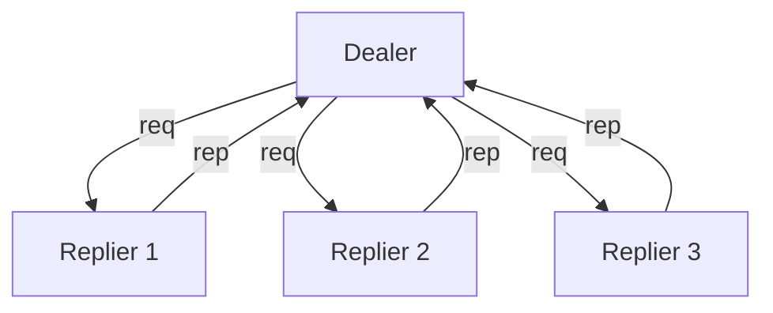
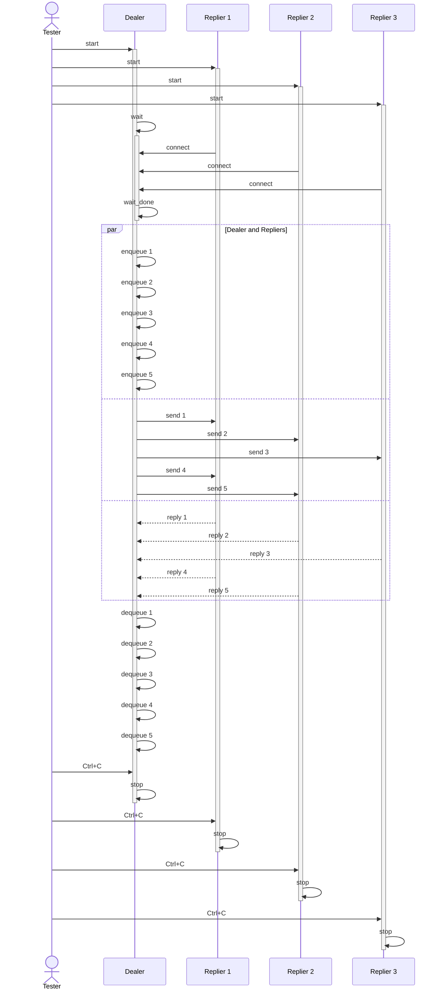

# Dealer to REP

## Overview

A dealer distributes messages to several repliers. It sends as many as it wants
and it receives everything afterwards.

## Constituents

- a dealer that sends a given amount of iterations, and receives the same amount
  in a secondary sequence
- multiple repliers that get the messages from the dealer in a round-robin
  fashion

## Flow diagram

## Test sequence diagram

## How to test

- start the repliers
- start the dealer

## Observations

- the dealer will distribute the messages in the round robin fashion to all
  repliers
- we have to wait a bit at the start of the dealer, to allow all the repliers to
  connect with the dealer in the background
- we have to send an en empty frame at the beginning of the multipart sequence,
  to indicate that this is a "REQ" type of frame, otherwise our replier will
  discard it
