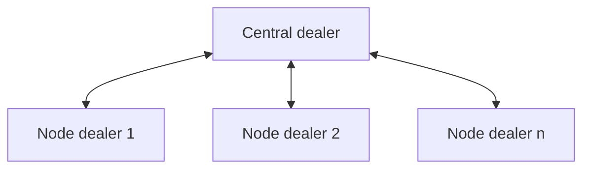

# Dealer to dealer - simple

## Overview

A bunch of dealers communicate with a central dealer.

## Flowchart

## How to test

- start the server
- start a node
- stop the node
- start another node
- stop the server

## Observations

- client-type of dealers will keep sending (until the HWM is hit), without the
  server up and running
