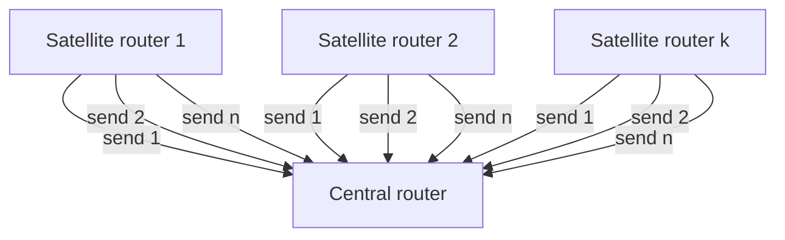
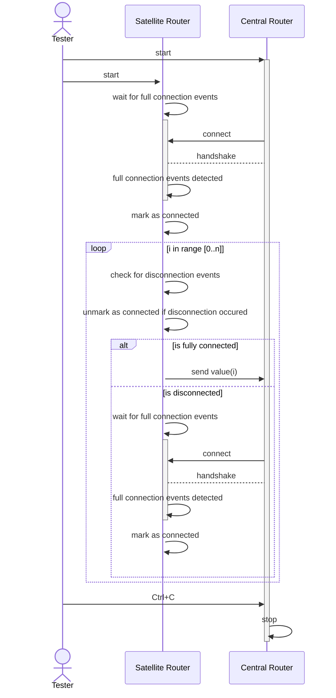

# Router to router

## Overview

## Flowchart

```mermaid
flowchart
  X[Central router]

  A[Satellite router 1]
  B[Satellite router 2]
  K[Satellite router k]

  A -- send 1 --> X
  A -- send 2 --> X
  A -- send n --> X

  B -- send 1 --> X
  B -- send 2 --> X
  B -- send n --> X

  K -- send 1 --> X
  K -- send 2 --> X
  K -- send n --> X
```

## Test sequence diagram

```mermaid
sequenceDiagram
  actor T as Tester

  participant S as Satellite Router
  participant X as Central Router

  %% initialization
  T ->>+ X : start

  %% satellite sequence
  T ->>+ S : start
  S ->>+ S : wait for full connection events
  X ->> S : connect
  S --> X : handshake
  S ->>- S : full connection events detected
  S ->> S : mark as connected

  loop i in range [0..n]
    S ->> S : check for disconnection events
    S ->> S : unmark as connected if disconnection occured
    alt is fully connected
      S ->> X : send value(i)
    else is disconnected
      S ->>+ S : wait for full connection events
      X ->> S : connect
      S --> X : handshake
      S ->>- S : full connection events detected
      S ->> S : mark as connected
    end
  end

  %% shutdown
  T ->> X : Ctrl+C
  X ->>- X : stop
```
