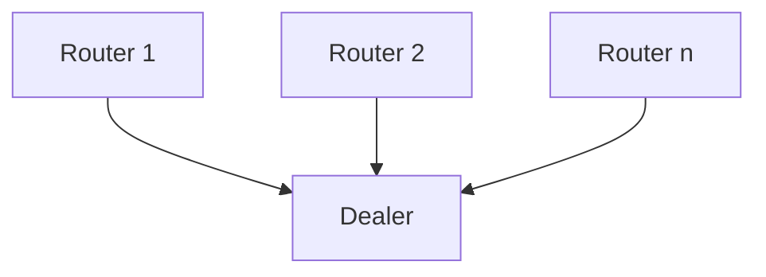

# many routers to one dealer

## Overview

Send messages from many routers (connecters) to one dealer (binder).

## Diagram

## How to test

- start a couple of routers
- start a dealer
- stop the dealer after a few messages
- start the dealer again

## Observations

- you need to have a clear ROUTING_ID to be able to send from the routers
- the routers sends continuously
- the routers don't block on send
- when the dealer connects for the first time, he receives only the messages
  from the moment of connection
- when the dealer connects a secondary time, he receives retroactively all the
  messages that were not dropped due to the routers HWM
- the router does not store the messages at first, but after the dealer connects
  the first time, it keeps a HWM amount of messages and drops the stale ones
  once the HWM is reached, effectively resetting the count
