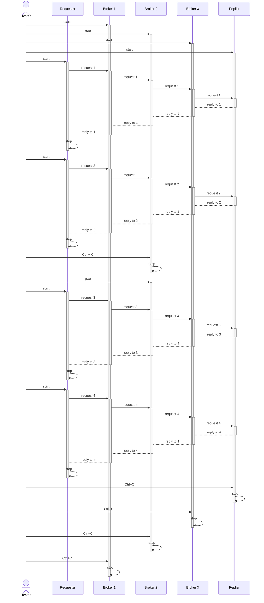

# Multiple identity layers due to multiple routers

## Overview

### Constituents:

- three brokers (A, B and C)
- a requester
- a replier

### Flow of requests and replies

## Test sequence diagram

## How to test

- start all the brokers
- start the replier
- run the requester two times
- restart broker 2
- run the requester two times

## Observations

- broker 1 receives from the router socket a multipart in the following format
  `[requester_address, b'', msg]`
- broker 2 receives from the router socket a multipart in the following format
  `[broker_1_address, requester_address, b'', msg]`
- broker 3 receives from the router socket a multipart in the following format
  `[broker_2_address, broker_1_address, requester_address, b'', msg]`
- essentially, the more brokers we have, the more addresses are prefixed to each
  of the messages
- the router strips each address layer when returning back to the originating
  dealer or the actual requester
- each new instance of the requester generates a new address:
  - `b'\x00\x80\x00A\xa7'`
  - `b'\x00\x80\x00A\xa8'`
  - `b'\x00\x80\x00A\xa9'`
  - `b'\x00\x80\x00A\xaa'`
- the same kind of address increment happens to the brokers. See how broker 3
  sees broker 2 before and after restart:
  - before: `b'\x00\x80\x00A\xa7'`
  - after: `b'\x00\x80\x00A\xa8'`
