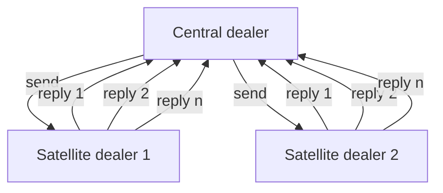
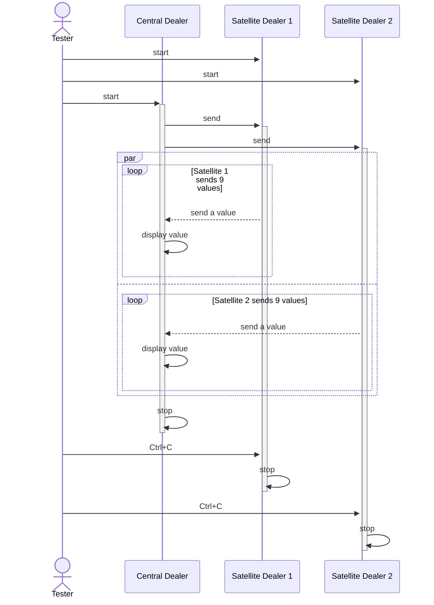

# Dealer to dealer

## Overview

Asynchronous send and receive between a central dealer and distributed dealers.

One can send as many times from the dealer and then receive many times from the
distributed dealer nodes.

## Diagram

## Test sequence diagram

## How to test

- open two satellite dealers
- open the central dealer

## Observations

- the central dealer and the satellite dealer can send and receive any number of
  times (of course within the limit of the buffer), and in any order as desired
- create an asynchronous way of dealing with sends and receives (compared to
  REQ/REP where you either mandatory have to send after a receive or receive
  after a send)
- you must keep in mind yourself for what is the reply destined, hence you need
  to use some sort of tracking ID
