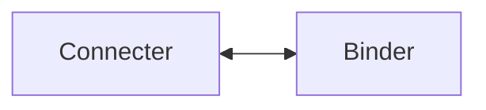
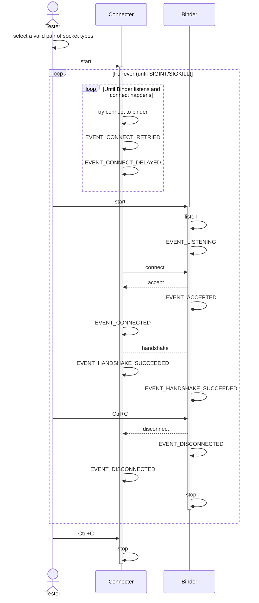
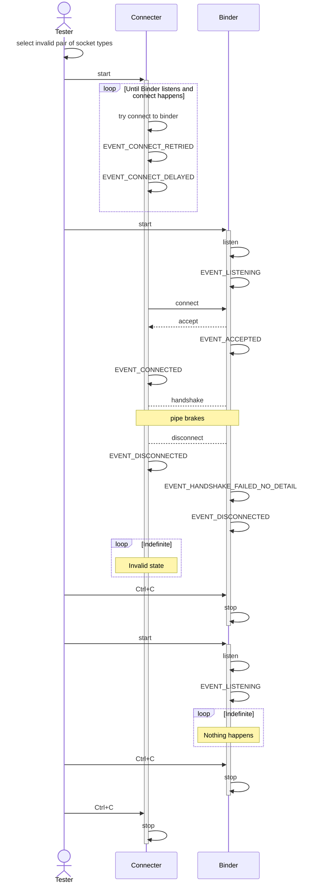

# Unpredictable state on wrong connection pair

## Overview

When we try to connect two types of sockets that aren't meant to be together, we
end up in a state that is unpredictable.

Examples of socket pairs that don't match

- REP with ROUTER
- REQ with DEALER
- PULL/PUSH with ROUTER
- PUB with REQ

## Constituents

## Test sequence diagram

### Positive flow

### Negative flow

## How to test the negative flow

- start the connecter
- start the binder and let it stabilise
- stop the binder
- start the binder and let it stabilise

## Observations

- after starting the connecter, it continuously tries to connect and emits
  **EVENT_CONNECT_RETRIED** and **EVENT_CONNECT_DELAYED** in a loop
- after starting the binder:
  - connecter emits:
    - **EVENT_CONNECTED**
    - **EVENT_DISCONNECTED**
  - binder emits:
    - **EVENT_ACCEPTED**
    - **EVENT_HANDSHAKE_FAILED_NO_DETAIL**
    - **EVENT_DISCONNECTED**
  - binder displays the reason for the error as: _**Broken pipe**_
