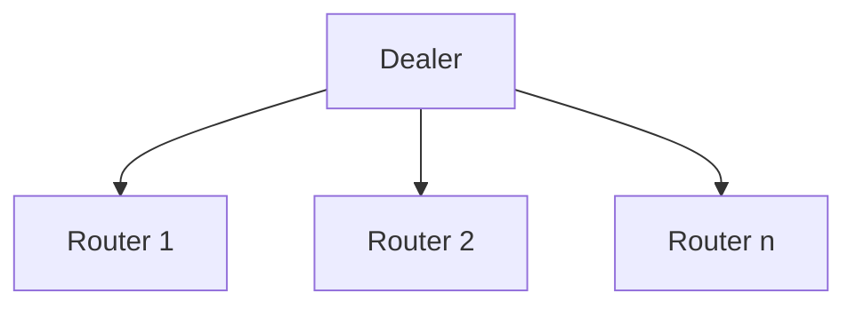

# one dealer to many routers

## Overview

Send messages from one dealer (binder) to many routers (connecters)

## Diagram

## How to test

- start a couple of routers
- start a dealer

## Observations

- the dealer will send continuously until the HWM is hit
- the routers will receive the messages but only as multipart
