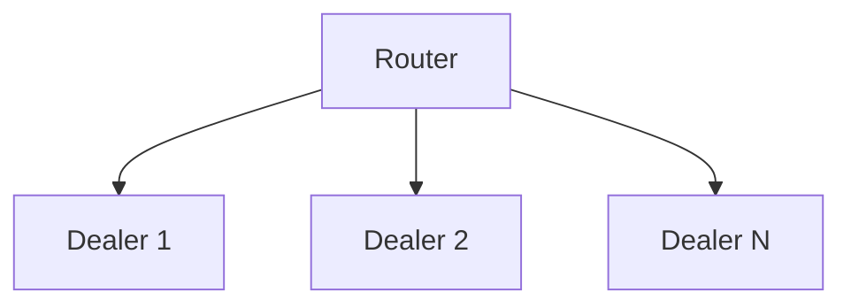

# one router to many dealers

## Overview

Send messages from one router (binder) to many dealers (connecters).

## Diagram

## How to test

### Without handover

- start dealer_a and dealer_b
- start the router without any flags and let it run a couple of seconds
- restart the router
- restart a dealer

### With handover

- start dealer_a and dealer_b
- start the router with `python router.py -rh` (where `-rh` represents _**router
  handover enabled**_)
- restart a dealer

## Observations

- you absolutely must know the routing IDs of the dealers when sending

- restarting router does not affect the flow of communication and it is
  immediately picked up from where it was left of

- restarting a dealer has specific consequences
  - if the router handover is disabled then the router no longer passes messages
    to the refreshed dealer, even if it has a fixed ROUTING_ID
  - if the router handover is enabled, then the dealer will simply continue
    receiving
