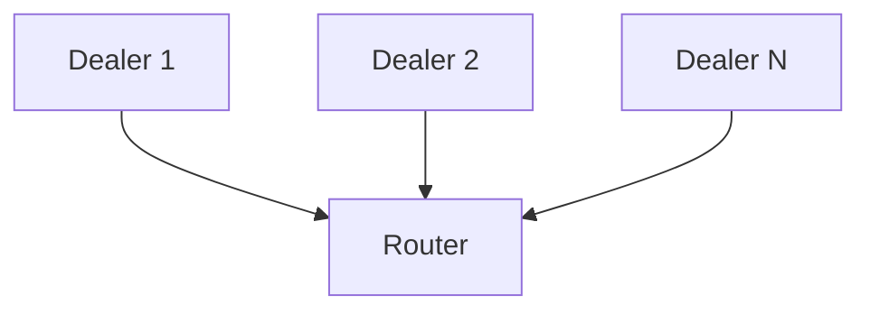

# many dealers to one router

## Overview

Many dealers (connecters) send messages to one router (binder).

## Diagram

## How to test

- start a few dealers
- start the router
- stop the router for a few seconds
- start the router
- restart a dealer

## Observations

- communication resumes whenever a party reconnects
- dealers sends continuously until HWM is hit and then drops old stale excess
  messages
