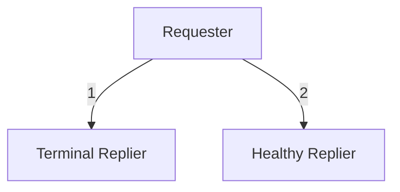

# Reliable Request-Reply - Lazy Pirate

## Overview

In the middle of the exchange, we might be waiting for a reply but the replier
might have died in the meantime or simply restarted.

### Problem

Requester will hang for ever in the _**wait-for-reply**_ step.

### Solution

- Timeout the reply and retry a few times
- Give up eventually if there is no reply:
  - close the socket
  - reopen the socket
  - resend the last message

## Constituents

## How to test

- start `01_requester`
- start `02_terminal_replier` and let it finish
- start `03_healthy_replier`

## Observations

- when terminal replier runs:
  - a message is passed from the requester to the replier
  - the requester enters the reliability loop
- when a healthy replier runs, everything runs normally
