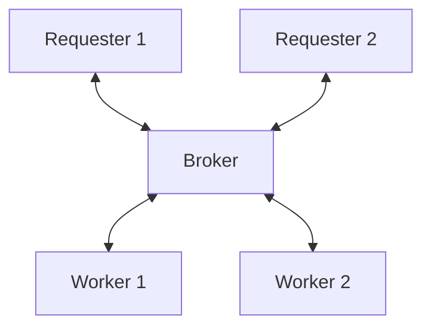

# Reliable Request-Reply - Simple Pirate

## Overview

In the middle of the exchange, we might be waiting for a reply but the replier
might have died in the meantime or simply restarted.

This is an extension of the lazy pirate in the sense that we want to use
additional workers that can take over failed requests from problematic workers.

### Problem

Some workers will hang for a long time or die.

### Solution

Re-distribute requests to healthy workers.

## Constituents

## How to test

- start `01_requester`
- start `01_requester`
- start `02_broker`
- start `03_terminal_replier`
- start `04_healthy_replier`

## Observations

- the requests that end up on the faulty worker eventually get rerouted to the
  healthy worker
- requests are not lost

## Caveats

- if the broker dies in the middle of an exchange, the workers might end up in a
  faulty state, blocked in a never ending _**wait-for-request**_ step
- idle workers that have failed are not detected by the broker, hence the worker
  will remain in queue
